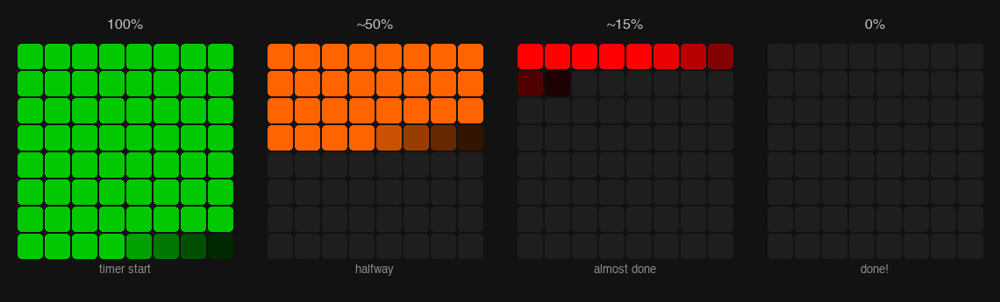

# LaunchProgress

Turn a Novation Launchpad Mini MK3 into a countdown timer. LEDs drain from full to empty, shifting green → amber → red.



## Usage

```
uv run timer.py              # pick duration by pressing a pad (1 pad = 1 min)
uv run timer.py 5m           # pass duration directly
uv run timer.py --serve      # start API server on :8000
uv run timer.py --serve --port 3000
```

Ctrl+C cancels and clears LEDs.

### API

```
curl -X POST localhost:8000/timer -d '{"minutes": 25}' -H 'Content-Type: application/json'
curl localhost:8000/timer
curl -X DELETE localhost:8000/timer
```

Docs at localhost:8000/docs. Brightness dims automatically at night.

### Claude Code / Codex skills

With the server running, use the bundled skills from your coding agent:

```
/timer 25m
/timer-status
/timer-cancel
```

Skills are in `.claude/skills/` (Claude Code) and `.agents/skills/` (Codex).

## Tests

```
uv run --with pytest --with httpx python3 -m pytest tests/
```

## Requires

- Python 3.10+
- [uv](https://docs.astral.sh/uv/)
- Launchpad Mini MK3 via USB
